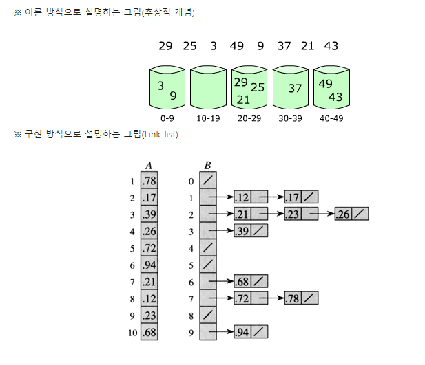

##Bucket Sort(버킷/계수/기수 정렬)

* 분포에 의한 정렬
	* 원소의 값을 비교하여 정렬 순서를 결정하는 비교 기반 정렬 알고리즘
	* 최악의 경우 비교 횟수는 O(nlogn)
	* 삽입정렬, 선택정렬, 합병정렬, 힙정렬, 퀵정렬, 버블정렬 등...
	
* Bucket Sort
	* 원소의 값을 비교하는 것이 아니라 키의 분포를 이용
	* 주로 특정 range안에 값이 균일하게 들어가있을 때 사용
	* O(n) + 버킷 내부 정렬시간
		* 키가 분포가 균일하다고 가정한다면 하나의 버킷에는 하나의 키만 들어있을 확률이 높으며, 만약 한 버킷에 여러 키가 들어가게 된다면 같은 버킷에 속하는 키끼리는 간단한 정렬 알고리즘으로 정렬
		* 모든 숫자들이 균일하게 분포되어있다면 버킷 내부 정렬시간들은 역시 O(n)만큼의 시간이 평균적으로 소요
		* 버킷 내부 정렬시간이 길다면 시간복잡도는 분포에 의한 정렬보다 높아질 수 있음
			* 버킷내부의 원소의 개수가 적다면 오버헤드가 적은 삽입정렬을 이용하는데 이 경우 최악의 경우엔 O(n\*n)소요
			* 버킷내부의 원소의 개수가 많다면 합병정렬 혹은 퀵정렬을 사용하는 구현을 하여도 좋다.
	* 참고자료
		* http://www.growingwiththeweb.com/2015/06/bucket-sort.html	
	
*   

* 정렬 과정
1. 빈 버킷을 n만큼 생성
	* n개의 키가 구간[min,max]을 n등분하고 이들 각각을 하나의 버킷으로 생성
2) 모든 원소들을 값에 따라 적절한 버킷에 넣음
	* 키가 구간내에서 균등하게 분포한다고 가정했으므로 하나의 버킷에는 하나의 키만 들어있을 확률이 높음
	* O(n) 소요
3) 각각의 버킷을 삽입정렬을 사용하여 정렬
	* 균등하게 분포되어있다면 평균적으로 O(n)소요
4) 버킷 순서에 따라 데이터를 합침
	* O(n) 소요
	
* 구현
	* sort.bucket\_sort	