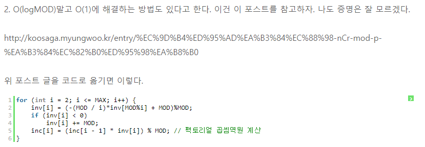

## 거듭제곱을 빠르게 구하는 방법

1. CalculatePow1
	* 시간복잡도 : O(logn)
	* 설명
		* 지수의 제곱승을 이용하여 logn(밑은2)만에 거듭제곱을 구할 수 있다.
		* a^multiplier를 구하는 방법은 아래처럼 표현 가능하다.
			1. a가 짝수라면 : a^(multiplier/2) \* a^(multiplier/2)
			2. a가 홀수라면 : a^(multiplier/2) \* a^(multiplier/2) \* a
		* 위의 방식으로 multiplier가 0이되면 a^multiplier=1이고, multiplier가 1이되면 a^multiplier=a이므로 multiplier가 0 또는 1이 될때까지 재귀호출하여 반복해서 계산하면 된다.

2. CalculatePow2
	* 시간복잡도 : O(logn)
	* 설명
		* a^multiplier는 multiplier를 2진수 비트표현으로 나타냈을 때 1인 비트일때마다 a^해당비트 수를 결과값에 누적해주면 된다.
			* 만약 2^5를 구하는 것이라면 5=101이므로 (2^1) \* (2^4)를 해주면 2^5가 된다.
		* 따라서 매 반복문 루프마다 multiplier의 맨 아래의 자릿수를 얻어서 이 비트가 1이라면 number를 결과값에 곱해준다. number의 경우는 매 반복마다 제곱을 시켜주어서 number에는 number^자릿수 가 들어가도록 유지해준다.
		
3. CalculatePow3 (Unsolved)
	* 시간복잡도 : O(1)
	* _이해를 하지 못해서 구현을 못하였다_
	*   
	* 출처 : http://kwony91.tistory.com/entry/%EB%AA%A8%EB%93%88%EB%9F%AC-%EB%82%98%EB%88%97%EC%85%88-%EC%97%B0%EC%82%B0-%EC%B2%98%EB%A6%AC%ED%95%98%EA%B8%B0