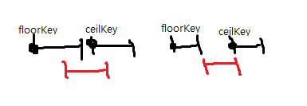

## 729. My Calendar I

**Difficulty:** Medium

https://leetcode.com/problems/my-calendar-i/description/

Implement a MyCalendar class to store your events. <br/>
A new event can be added if adding the event will not cause a double booking. <br/>

Your class will have the method, book(int start, int end). <br/>
Formally, this represents a booking on the half open interval [start, end), the range of real numbers x such that start <= x < end. <br/>

A double booking happens when two events have some non-empty intersection (ie., there is some time that is common to both events.) <br/>

For each call to the method MyCalendar.book, return true if the event can be added to the calendar successfully without causing a double booking. <br/>
Otherwise, return false and do not add the event to the calendar. <br/>

Your class will be called like this: <br/>
MyCalendar cal = new MyCalendar(); <br/>
MyCalendar.book(start, end)

```
MyCalendar();
MyCalendar.book(10, 20); // returns true
MyCalendar.book(15, 25); // returns false
MyCalendar.book(20, 30); // returns true
Explanation: 
The first event can be booked.  The second can't because time 15 is already booked by another event.
The third event can be booked, as the first event takes every time less than 20, but not including 20.
```

**Note:**
1.The number of calls to MyCalendar.book per test case will be at most 1000.
2. In calls to MyCalendar.book(start, end), start and end are integers in the range [0, 10^9].

**Show tag:** \#array

-------------------------------------

모든 Solution의 출처는 https://leetcode.com/problems/my-calendar-i/discuss/ <br/>

**BestSolution : Using TreeMap** <br/>
시간복잡도 : O(1) 공간복잡도 : O(1) <br/>
스케쥴이 잡혔을때 해당 스케줄이 캘린더에 등록가능한지를 확인하기 위해서는 겹치는 스케줄이 있는지를 봐야한다. <br/>
스케줄이 겹치는지 보기 위해서는 이미 잡혀있는 스케줄들 중에서 해당 스케줄의 start시점보다 작거나 같은 스케줄 중 가장 큰 start를 갖는 스케줄(floor스케줄)과, 크거나 같은 스케줄 중 가장 작은 start를 갖는 스케줄(ceil스케줄) 두개와 비교를 하면 된다. <br/>
 <br/>
위의 왼쪽 그림은 스케줄이 겹치는 경우이고 오른쪽 경우는 스케줄이 겹치지 않는 경우인데, <br/>
스케줄이 겹친다면 해당 스케줄의 start지점이 floor스케줄의 end지점보다 작거나, 해당 스케줄의 end 지점이 ceil스케줄의 start지점보다 큰 경우이다. <br/>
따라서 TreeMap에 key순으로 정렬하여 잡고자하는 스케줄의 floor스케줄과 ceil스케줄을 얻어서 해당 스케줄이 두 스케줄과 겹치는지의 여부를 판단하여 캘린더에 등록할지말지를 결정하면 된다. <br/>

**Best Solution : Using TreeSet** <br/>
시간복잡도 : O(1) 공간복잡도 : O(1) <br/>
Best Solution1과 로직은 동일하고 TreeMap이 아닌 TreeSet에 2size int 배열을 넣어서 구현한것이다. <br/>

**Best Solution3 : Using List** <br/>
시간복잡도 : O(n) 공간복잡도 : O(1) <br/>
_Best Solution과 겹치는 상황설명은 패스_ <br/>
두 스케줄이 있을때 겹치는지 겹치지 않는지를 판단하기 위해서는 두 스케줄의 더 큰 start지점과 더 작은 end지점을 구해서 start < end이면 겹치는 것이다. <br/>
(두 스케줄의 작은 start는 큰 start보다 무조건 앞에 있으며, 큰 end는 작은 end보다 무조건 뒤에 있다. 큰 start가 작은 end보다 작다는 것은 하나의 스케줄이 시작되었는데 다른하나의 스케줄이 끝나지 않았다는 것이기 때문에 겹친다는 것이다.) <br/>
따라서 등록된 스케줄이 누적된 list를 순회하면서 두 스케줄이 겹치는지 안겹치는지를 확인하며, 모든 스케줄과 겹치지 않을 경우 캘린더에 등록하면 된다. <br/>

이유는 모르겠지만 Best Solution3이 가장 빠르게 나왔다. <br/>
TreeMap과 TreeSet의 내부 정렬 문제가 아닌가 싶다.